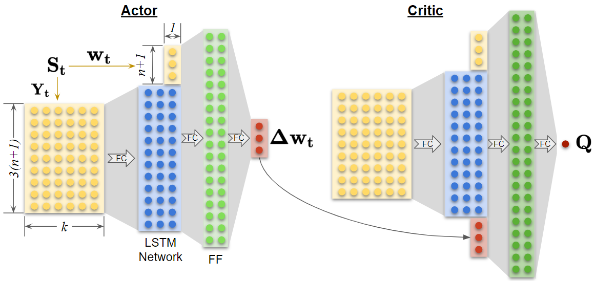
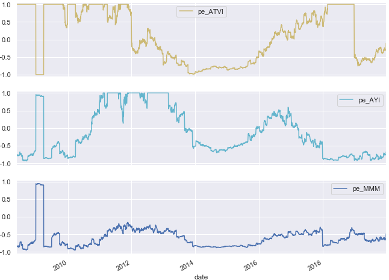

# DRL Portfolio Optimization
A portfolio optimization framework leveraging Deep Reinforcement Learning (DRL)

This document gives an overview of the project and contains many links to other resources.  Developers are directed 
to the [Wiki](https://github.com/daniel-fudge/DRL-Portfolio-Optimization/wiki), which provides much more execution and
implementation detail.  For a high level discussion of this project, please see [report 1](docs/report1.pdf) and 
[report 2](docs/report2.pdf).    

There is YouTube playlist found [here](https://www.youtube.com/playlist?list=PLJtqqeC4KrwQos6A3uMbZloJgM54R0H12) that 
include videos on the following topics.   
1. Starting an AWS SageMaker Instance, [link](https://youtu.be/w2r8ffcBVSo)
1. Data Processing for LSTM, [link](https://youtu.be/iDl4JzgOv6M)
1. LSTM Signal Generation, [link](https://youtu.be/zH_MzCnspK8)
1. Data Processing for Technical & Fundamental signals, [link](https://youtu.be/g0Vm1cbVADA)
1. Reinforcement Learning on AWS Sagemaker, [link](https://youtu.be/4MTBMnpHK00)
  
### Table of Contents
- [Motivation](#motivation)
  - [Term 1 - Initial Investigation (Winter 2019)](#term-1---initial-investigation-winter-2019)
  - [Term 2 - Architectural Design (Fall 2019)](#term-2---architectural-design-fall-2019)
  - [Term 3 - Implementation (Winter 2020)](#term-3---implementation-winter-2020)
  - [Term 4 - Enhancement (Summer 2020)](#term-4---enhancement-summer-2020)
- [AWS Execution](#aws-execution)
- [Local Execution](#local-execution)
- [Data Preparation](#data-preparation)
- [LSTM Development](#lstm-development)
- [Deep Reinforcement Learning (DRL)](#deep-reinforcement-learning-drl)
- [Conclusions and Future Work](#conclusions-and-future-work)
  - [Deep Learning Architectures](#deep-learning-architectures)
  - [Training Process](#training-process)
  - [Signal Generation](#signal-generation)
  - [Reward Function](#reward-function)
- [License](#license)
- [Contributions](#contributions)

## Motivation
This repo was created during an Independent Study of [Daniel Fudge](https://www.linkedin.com/in/daniel-fudge) with [Professor Yelena Larkin](https://www.linkedin.com/in/yelena-larkin-6b7b361b/) 
as part of a concurrent Master of Business Administration (MBA) and a [Diploma in Financial Engineering](https://schulich.yorku.ca/programs/fnen/)
from the [Schulich School of Business](https://schulich.yorku.ca/).  The study was broken into 3 terms as described 
below.

#### Term 1 - Initial Investigation (Winter 2019)
The first term was a general investigation into the "_Application of Machine Learning to Portfolio Optimization_".  Here 
we reviewed the different aspects of machine learning and their possible applications to Portfolio Optimization.  During 
this investigation we highlighted **Reinforcement Learning (RL)** as an especially promising area to research and 
proposed the development of a Reinforcement Learning framework to better understand its possible applications.  

Please see the 1st term [report](docs/report1.pdf) for the detailed discussion.  

#### Term 2 - Architectural Design (Fall 2019)
##### Udacity Deep Reinforcement Learning Nanodegree
The [1st term report](docs/report1.pdf) identified the Udacity "Deep Reinforcement Learning" 
Nanodegree as a first step toward gaining a better understanding of this topic.  Both the [syllabus](docs/DRL_Nanodegree_Syllabus.pdf)
and the [site](https://www.udacity.com/course/deep-reinforcement-learning-nanodegree--nd893) provide a detailed 
description of the Nanodegree.  
This Nanodegree involved the developing DRL networks to solve 3 different [Unity ML-Agents environments](https://unity3d.com/machine-learning/).
The solutions to these environments can be found in the following GitHub repositories:
- [Banana Collector](https://github.com/daniel-fudge/banana_hunter)
- [Reacher](https://github.com/daniel-fudge/reinforcement-learning-reacher)
- [Tennis](https://github.com/daniel-fudge/reinforcement-learning-tennis)

##### Architectural Design Report
With the Udacity Nanodegree complete and a greater understanding of DRL obtained, the 2nd term report, found [here](docs/report2.pdf), 
was generated to detail the proposed "_Deep Reinforcement Learning Architecture for Portfolio Optimization_".  This 
report also described the future research required prior to the 3rd term implementation and suggested future work after 
the 3rd term implementation is complete.  

#### Term 3 - Implementation (Winter 2020)
With the problem statement and architecture defined in the [term 2 report](docs/report2.pdf), term 3 fully implemented 
the architecture.  Note that the intent of this implementation is not to advance the state-of-the-art in DRL or its 
application to portfolio optimization.  Instead it is to generate a functioning DRL platform for portfolio optimization.  
From this conventional implementation, we can experiment with more advanced techniques as highlighted in the 2nd term 
report.  Term 3 summarizes not only the implementation but also the development environment to lower the barrier to 
entry for researchers new to DRL and the deployment of cloud-based applications.   

#### Term 4 - Enhancement (Summer 2020)
The training process discussed in the future work below was addressed in a 4th term captured in a new [repo](https://github.com/daniel-fudge/DRL-Portfolio-Optimization-Custom). 

##### Udacity - Deep Learning Nanodegree
The term 2 report identified the Udacity "Deep Learning" Nanodegree as a good way to gain a better understand of deep 
learning networks with a special focus on [PyTorch](https://pytorch.org/), [LSTM](https://colah.github.io/posts/2015-08-Understanding-LSTMs/)
networks and [AWS SageMaker](https://aws.amazon.com/sagemaker/).  This was completed in January 2020 and laid the 
foundation for this project.  For more information on this nanodegree, please see this [site](https://www.udacity.com/course/deep-learning-nanodegree--nd101). 

##### A Cloud Guru - AWS Certified Machine Learning - Specialty 2020 
During the implementation of the DRL architecture it became evident that a deeper understanding of AWS Sagemaker was 
required.  To satisfy this need, the "AWS Certified Machine Learning - Specialty 2020" from [A Cloud Guru](https://acloud.guru/learn/aws-certified-machine-learning-specialty) 
was completed. The content was excellent and is highly recommended.

##### AWS Sagemaker - Example Notebooks  
One of the great aspects of developing on AWS is the large community and resources available.  The YouTube [videos](https://www.youtube.com/playlist?list=PLJtqqeC4KrwQos6A3uMbZloJgM54R0H12)
illustrate how to access the library of Sagemaker examples and they can also be access on GitHub [here](https://github.com/awslabs/amazon-sagemaker-examples/blob/master/README.md).

## AWS Execution
It is highly recommended that training of the deep learning models be executed on AWS to leverage its computing power.
Many other parts may be executed locally to avoid AWS charges or on AWS since the charges for light instances is less 
than pennies per hour.  The cost of a simple notebook instance on SageMaker is extremely cheap and cost really only 
accumulates when you train the model (don't forget to shut down when finished!!!).  If you are new to AWS and SageMaker, 
I recommend the AWS SageMarker [tutorial](https://aws.amazon.com/getting-started/tutorials/build-train-deploy-machine-learning-model-sagemaker/).   
For instructions on how to setup and run on AWS, please see the associated [Wiki Page](https://github.com/daniel-fudge/DRL-Portfolio-Optimization/wiki/AWS-Execution).

## Local Execution
Although it is not recommended to train on a local PC, you may want to run locally to debug.  If so, please see the 
instructions on the associated [Wiki page](https://github.com/daniel-fudge/DRL-Portfolio-Optimization/wiki/Local-Execution).
 
## Data Preparation
The first and one of the most important stage of this project is data preparation.  This was actually completed twice in 
this project.  Please see the LSTM [data-preparation](data-preparation.ipynb) and the technical and fundamental 
signals [data-preparation-no-memory](data-preparation-no-memory.ipynb) notebooks for the data preparation process.

## LSTM Development
Figure 8 on page 18 of [report 2](docs/report2.pdf) copied below illustrates how the 1st layer of both the actor and 
critic networks is a Long Short-Term Memory (LSTM) network that processes the price history into signals that are passed 
to the Fully Connect (FC)  Feed-Forward (FF) neural networks.    

Before beginning training of the full Deep Deterministic Policy Gradient (DDPG) architecture above, we experimented 
with different LSTM architectures, hyper-parameters and possible predictions.  For instance, predicting the stock 
movement 1 day in the future is much easier than 1 month.  Also predicting the direction is much easier than the actual
price.  The [signal-processing](signal-processing.ipynb) notebook and associated YouTube [video](https://youtu.be/zH_MzCnspK8) 
captured this experimentation. Unfortunately this experimentation indicated that the signals from the LSTM were not as 
strong as expected so we switch to the development of technical and fundamental signals as captured in the [data-preparation-no-memory](data-preparation-no-memory.ipynb) 
notebook and the associated [video](https://youtu.be/g0Vm1cbVADA).       

## Deep Reinforcement Learning (DRL)
The two critical inputs to the DRL model are the signals that define the environment and the reward function.  The 
fundamental and technical signals defined the environment and the 1-day log-returns defined the reward function.  The
[drl-portfolio-optimization](drl-portfolio-optimization.ipynb) notebook and associated [video](https://youtu.be/4MTBMnpHK00)
capture this training and evaluation process.

## Conclusions and Future Work
The intent of this project was to gain a better understanding of how machine learning could be used to perform portfolio 
optimization.  [Report 1](docs/report1.pdf) began this journey with a broad review of machine learning and its 
applications.  It identified Deep Reinforcement Learning (DRL) as a promising area of research.  [Report 2](docs/report2.pdf)
extending this research by performing a deep dive into DRL and proposing a development approach and DRL architecture.  
This culminated in the 3rd term development and testing of a DRL process on AWS Sagemaker.   
As demonstrated in the training [video](https://youtu.be/4MTBMnpHK00) the DRL algorithm reliably beat the market 
(buy and hold), which is a good first step but I believe this can be greatly improved with the research into the 
following areas.
1. Deep Learning Architectures
1. Training Process (Continued in [4th term](https://github.com/daniel-fudge/DRL-Portfolio-Optimization-Custom))
1. Signal Generation
1. Reward Function

#### Deep Learning Architectures
The LSTM tested in this project was one attempt to use deep learning to extract signals from the price history, 
effectively generate a new and hopefully superior technical analysis.  Although we were not successful in extracting 
meaningful signals with a LSTM, a better and/or larger architecture may have been successful.   
We also used a Proximal Policy Optimization (PPO) algorithm from the Intel AI Labs [RL Coach](https://github.com/NervanaSystems/coach#batch-reinforcement-learning).
Although this is a well respected algorithm, it is quite possible that a different algorithm or even a PPO with 
different hyper parameters could have performed better.    
Considering the intense research in this area from many fields outside finance, I believe this is an area best left to 
the experts in the field and should not be a focus of finance practitioners.
   
#### Training Process
As discussed in the training [video](https://youtu.be/4MTBMnpHK00), the standard train-test procedures for machine 
learning are not well suited for portfolio optimization.  The fundamental issue is the rules of the game keep evolving 
for portfolio optimization.  An interesting analogy is a game playing DRL model.  For instance when a DRL is trained for 
chess, the rules never change.  A model that could beat a grand master in chess would fail to beat a child at checkers 
because the rules changed.  However, there is a great deal of research into models that learn new games; effectively 
adapting to a new set of rules.  In the game playing model the rules change very abruptly and the model is given time to 
adapt.    
In portfolio optimization the rules are constantly in flux and a the true measure of a model is how quickly you adapt.  
This is equivalent to a trader who notices a change in the market and rapidly switches strategies.  Training a model on
10 years of data and then running it for 2 years, as was proposed in report 2, is simply not realistic.  The true test 
would be to train extensively on all historical data upto and including yesterday, then make your trades.  Once the 
feedback from the environment is received, retrain and make more trades.    
This is effectively the RL feedback loop but when testing the algorithm you only get one pass through the "timeline".  
At time _T_ you can use a prioritized replay of the price history from _t_= [0, _T_-1] to retrain as much as possible.
However, the performance of your model can only be assessed at _t_ = _T_.  If assessed before _T_, there is data leakage 
because the model knows how the rules have changed.  If assessed after _T_, the model will be unfairly penalized because
it is missing information on [T, t], which it would have in real world trading.  To go back to the game playing analogy,
the model is only evaluated on its first game of checkers after mastering chess and every day it has to play a new game.    
I believe this is a very novel application of DRL and one worth further investigation.

#### Signal Generation
Signal generation is an area where financial experts can truly add value.  All deep learning models live and die on the 
quantity and quality of the input date.  Here we can bring the concepts of value investing first outlined by Graham and 
Dodd in [Security Analysis](https://en.wikipedia.org/wiki/Security_Analysis_(book)) into the model.  In our highly 
connected world we can replicate, with more accuracy each year, an analyst laboriously reviewing financial statements to 
uncover the true value of a company.  A simple example is the p/e ratio used in this model.  As shown below there is a 
massive inversion of the p/e ratio generated by a violent swing in the net income reported by Activision Blizzard, Inc. 
(ATVI) in the 4th quarter of 2009.  An investigation into this swing may uncover a better way to represent the net 
income and resulting p/e ratio.

#### Reward Function
The reward function in this report was simply the log return of the portfolio before the next set of trades minus 
trading costs.  This is an other area where the financial expert can add significant value by adding other positive or
negative rewards.  For instance we may care more about the long term reward function or want to add an extra negative 
reward for a large negative return.  

## License
This code is copyright under the [MIT License](LICENSE).

## Contributions
Please feel free to raise issues against this repo if you have any questions or suggestions for improvement.
